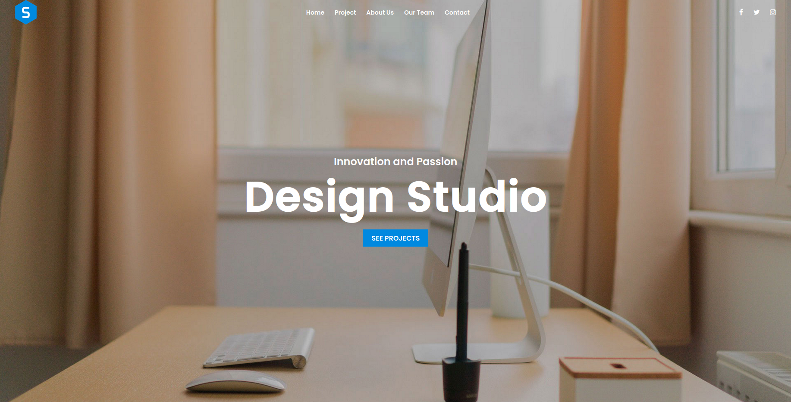

# portfolioWJQ

This is a portfolio created using jquery, HTML, and CSS. In this project, I code along with Sergio Agamez's course (Marquetacion de sitios web con javascript y jquery) for practice and learning purposes.

   
   
   
   
   

## Live Version

[Portfolio Live](https://widzthedvloper.github.io/portfolioWJQ/)
## Pages

## Prerequisites

- jQuery
- Code Editor(VScode)

## Usage

1. Clone the repository by using the `git clone git@github.com:widzthedvloper/portfolioWJQ.git` command in your terminal
2. `cd` into the cloned repository
3. Open the folder in the code editor of your choice :)
4. Open the index.html file in your favorite browser

## Contributing

This project is for educational purposes.

## Acknowledgment

- Sergio Agamez
- Crehana

👤 **Widzmarc Jean Nesly Phelle**

- GitHub: [@widzthedvloper](https://github.com/widzthedvloper)
- Twitter - [@widzthedvloper](https://twitter.com/widzthedvloper)
- LinkedIn: [@widzthedvloper](https://www.linkedin.com/in/widzmarc-jean-nesly-phelle-252a26129/)

### Show your support

Give a ⭐️ if you like this project!

## License

MIT License
